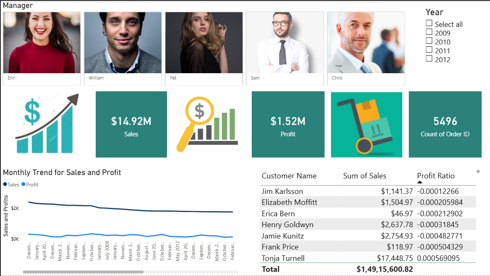
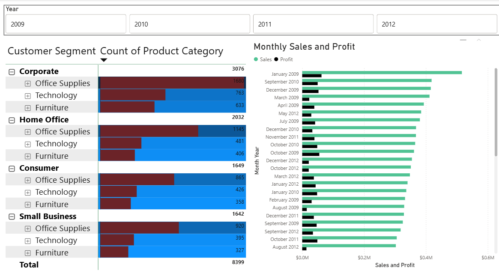
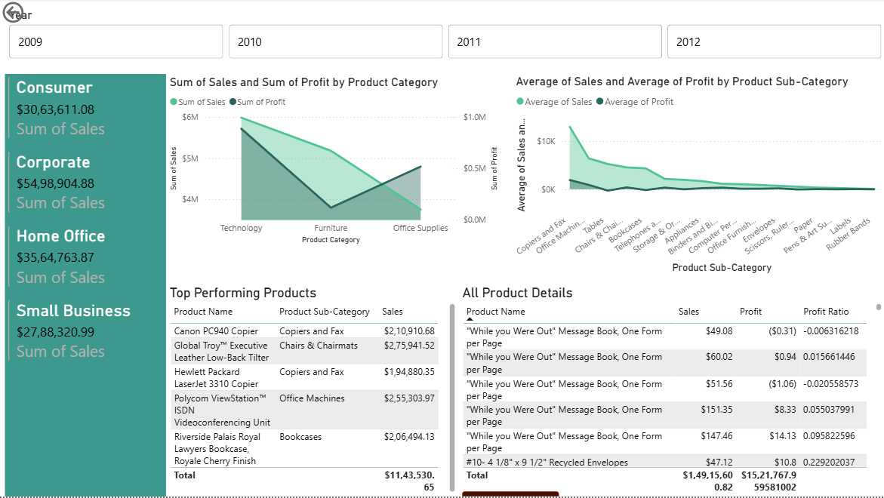

# 📊 Sales Performance Dashboard
### Interactive Power BI Dashboard for Sales, Profit & Product Performance Analysis


---

# 📖 Overview

This project is an interactive **Power BI Sales Dashboard** built using a retail sales dataset to analyze business performance across customers, products, managers, and regions.

The dashboard provides valuable business insights by tracking sales, profit, customer segments, product performance, and manager-wise sales using interactive reports and KPI cards.

---

# 📊 Dashboard Preview

## 🏠 Executive Dashboard



---

## 📈 Sales Analysis



---

## 📦 Product Performance



---

# 🎯 Objectives

- Analyze overall sales performance.
- Track profit across different years.
- Compare product categories and sub-categories.
- Identify top-performing products.
- Analyze customer segments.
- Monitor manager-wise sales performance.
- Build an interactive business intelligence dashboard.

---

# 🗂 Dataset

**Source**

Practice Retail Sales Dataset

**Domain**

Retail Sales Analytics

**Contains**

- Orders
- Products
- Customers
- Managers
- Returns
- Regions
- Sales
- Profit

---

# 🧹 Data Preparation

Power Query was used to clean and prepare the data.

### Transformations

- Promoted Headers
- Changed Data Types
- Added Custom Columns
- Data Formatting
- Data Cleaning

---

# 🏗 Data Model

The dashboard combines multiple tables including:

- Orders
- Returns
- Users
- Images

Relationships were established to support filtering and cross-report analysis.

---

# 📌 Dashboard Features

### Executive Summary

- 💰 Total Sales
- 💵 Total Profit
- 📦 Total Orders

### Interactive Analysis

- Manager-wise Sales
- Product Performance
- Customer Segment Analysis
- Product Category Analysis
- Product Sub-category Analysis
- Monthly Sales Trend
- Monthly Profit Trend

### Interactive Visualizations

- KPI Cards
- Line Charts
- Clustered Bar Charts
- Tables
- Matrix Visuals
- Slicers
- Drill-down Analysis

---

# 📄 Dashboard Pages

### 🏠 1. Executive Dashboard

- Overall Sales
- Total Profit
- Orders
- Monthly Trend
- Manager Performance

---

### 📈 2. Sales Analysis

- Customer Segment Analysis
- Product Category Analysis
- Monthly Sales vs Profit

---

### 📦 3. Product Performance

- Product Category Comparison
- Product Sub-category Analysis
- Top Performing Products
- Detailed Product Metrics

---

# 🔍 Key Insights

- Technology products generated the highest sales.
- Product performance varies significantly across sub-categories.
- Corporate customers contributed the largest share of sales.
- Monthly sales and profit trends help identify seasonal patterns.
- The dashboard enables quick identification of high-performing products and managers.

---

# 🛠 Technologies Used

- Microsoft Power BI
- Power Query
- DAX
- Data Modeling
- Business Intelligence
- Data Visualization

---

# 💡 Skills Demonstrated

- Business Intelligence Reporting
- Dashboard Development
- Data Cleaning
- Data Modeling
- KPI Design
- Interactive Reporting
- Sales Analytics
- Profitability Analysis
- Customer Analytics

---

# 📂 Repository Structure

```text
sales-performance-dashboard-powerbi/
│
├── Sales_Performance_Dashboard.pbix
├── README.md
│
└── images/
    ├── dashboard1.png
    ├── dashboard2.png
    └── dashboard3.png
```

---

# 🚀 How to Use

1. Clone or download this repository.
2. Open the `.pbix` file using Microsoft Power BI Desktop.
3. Interact with the dashboard using filters and slicers.
4. Explore sales, profit, customer, and product insights.

---

# 🔮 Future Improvements

- Add regional sales forecasting.
- Integrate SQL as the data source.
- Include drill-through reports.
- Add customer retention and return rate analysis.
- Connect to live business data sources.

---

## ⭐ If you found this project interesting, consider giving the repository a star!
